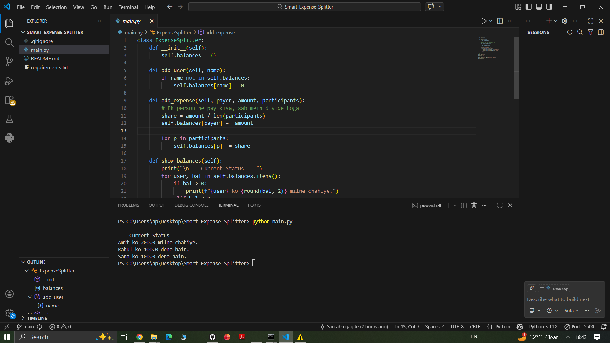

# 💸 Smart Expense Splitter (Pro)



An advanced command-line utility designed to handle group expenses with a focus on **Minimal Cash Flow Optimization**. No more messy spreadsheets or confusing "who owes whom" messages.

---

## 🚀 Key Features

-   **Smart Debt Simplification:** Uses a greedy algorithm to reduce the number of transactions between members.
-   **Dynamic Group Management:** Add users on the fly and record expenses instantly.
-   **Tabular Data Visualization:** Beautifully formatted CLI tables for clear balance sheets.
-   **Validation Engine:** Prevents negative entries and handles edge cases (like empty groups).
-   **Persistent Logging:** (Optional) Keeps track of all transaction history.

---

## 🛠️ Tech Stack

-   **Language:** Python 3.x
-   **Core Logic:** Greedy Algorithm / Min-Cash Flow
-   **Formatting:** `tabulate` library for professional CLI UI

---

## 📦 Installation & Setup

1. **Clone the repository:**
   ```bash
   git clone [https://github.com/YOUR_USERNAME/Smart-Expense-Splitter.git](https://github.com/YOUR_USERNAME/Smart-Expense-Splitter.git)
   cd Smart-Expense-Splitter
